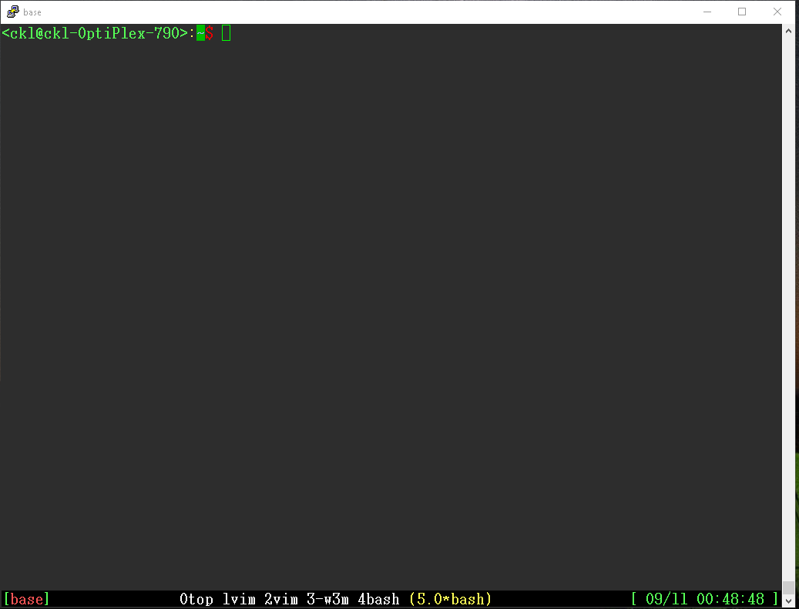
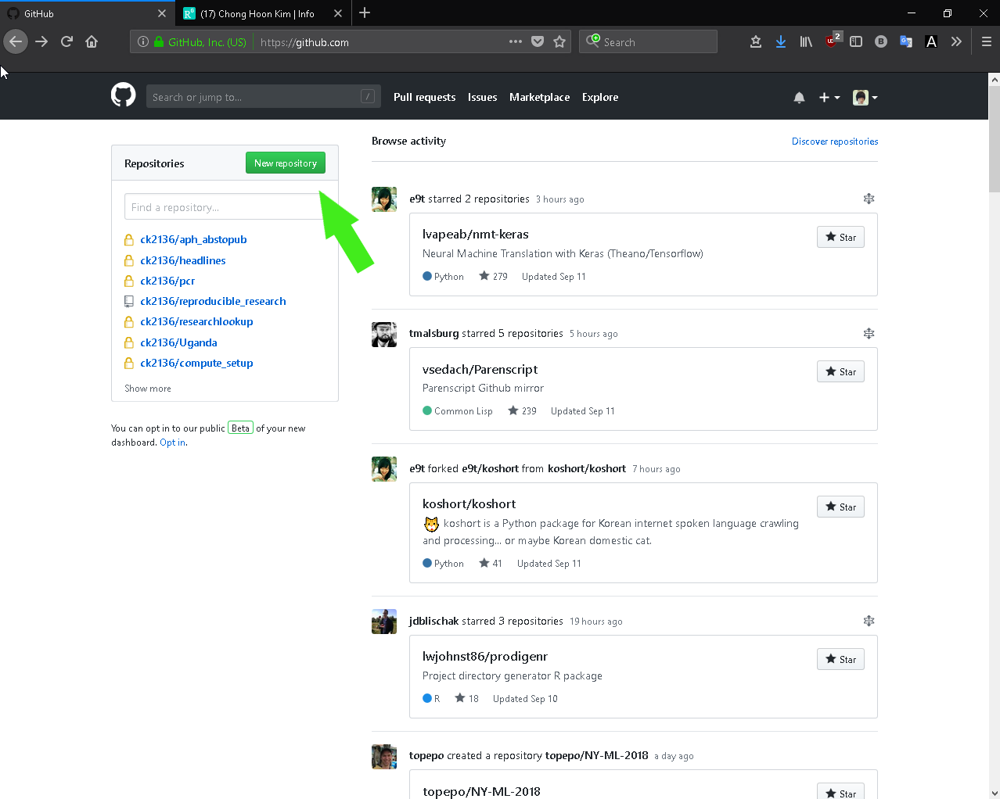
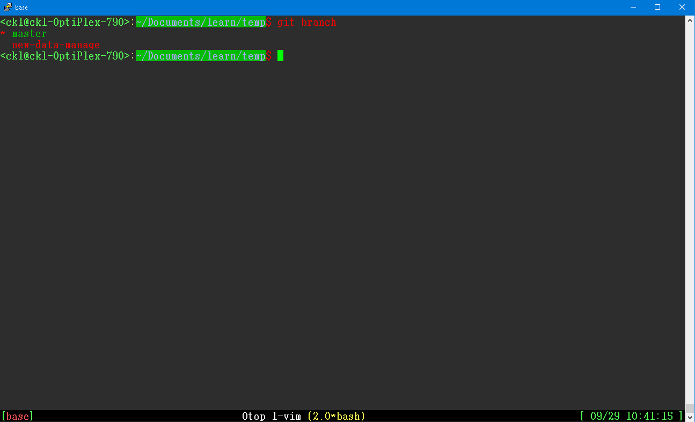
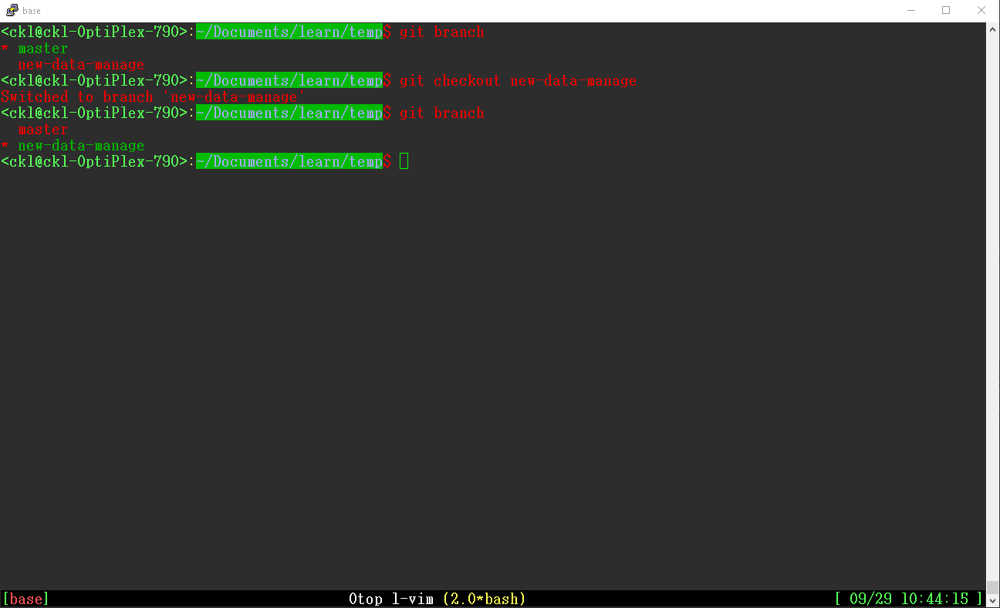
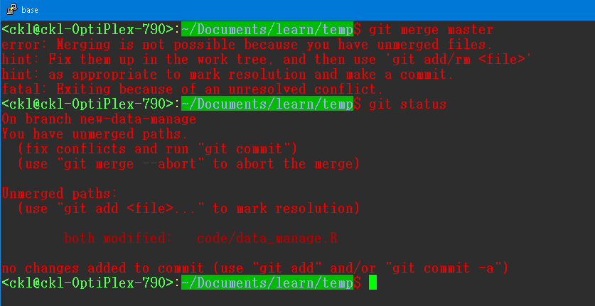
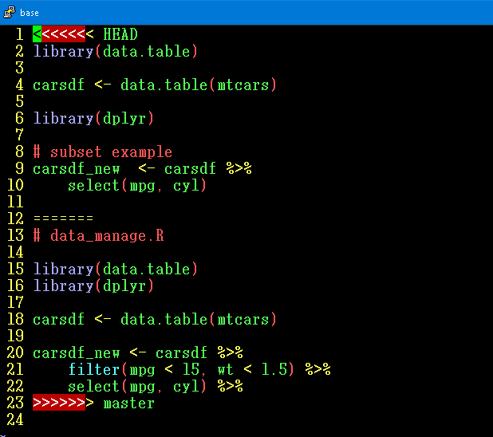
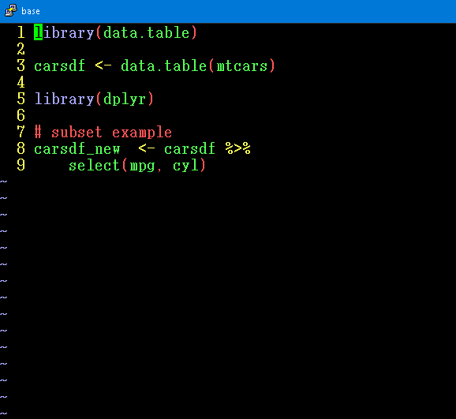

# Reproducible Research and CI/CD Tutorial

## Reproducible Research

- What: Doing research in a way that is efficient and transparent. 
- Why: Check news on issues related to research not being reproducible. 
- How: Follow protocols that boost efficiency and transparency.
	- Mostly using tools created by software developers

Software (Topics) to cover:

- Git (Reproducible Research)
- Make (Automated build tool)
- Jenkins (Continuous Integration/Development/Deployment)


## Git

What is git?
------------

Git is a version control tool. Most of us have exposure to a graphical version control tool known as Dropbox, OneDrive, and/or Google Drive. Git is a basic command line version control tool that allows people that write code to track changes. This document is here to help everyone get a good grasp of what is git and why we use it :) For a more detailed account, check the [wiki](https://en.wikipedia.org/wiki/Git)

Schematic of Git:


* Photo from http://blog.podrezo.com/git-introduction-for-cvssvntfs-users/#more-231 


The purpose of using git
------------------------

Since I'd like to keep the document short, I'll list only the most important aspects of git:

- Git is a decentralized/distributed version control tool.
- Git makes us think about the version control process.
- Git is an automated version control system.

There are plenty more reasons to choose to use git as a version control system but I won't list all of that here. We'll go through use cases and make sure that at least see those that are listed above are good enough reason to continue to use git.

Installing git!
---------------

- Windows:
    - go to [link](https://git-scm.com/download/win). This should start an automatic download... If not hit the 32-bit or 64-bit Git for windows.
    - The installer provides a terminal application called 'Git Bash', which is an emulator for a Unix-based system such as Linux and MacOS X. The Git Bash environment will make it so that commands written will give us same results as if it was done in a Unix environment.

- Linux
    - type "sudo apt-get install git" if you don't have git already
    - If you aren't sure type "which git" and you should see a output that shows where the git binary is located in your system.

- MacOSX
    - go to [link](https://git-scm.com/download/mac). This should start an automatic download.

*We are going to exclusively be using the command-line environment for the rest of the exercise* The reason is because it is how git was first intended to be used and it'll make you look cooler (at least for a brief period of time until you decide to use an IDE like Rstudio).

Command line tutorial
---------------------

People call the command-line interpreter the *shell*. It's called the shell because the interpreter is protecting itself from inexperienced users like ourselves from doing something stupid/crazy. Essentially there are bits and bytes that move around the computer based on the command that we enter and a random command that is issued could potentially lead to breaking to system so the idea is to always be mindful of what we're typing in :) 

- Windows:
    - Open up Git Bash!

- MacOS X:
    - Look for the "Terminal" application in the launchpad or through the spotlight icon (Command + Space)

- Linux:
    - Ctrl + Alt + T will open up the terminal in desktop mode.


When you open up the terminal you'll see something like this:



```
root@machine:~$
```

The prompt will be different for everyone but essentially this is where everyone can start typing in commands so that the shell program takes your command. The default shell that most of us will be using is 'bash' (**b**orn **a**gain **sh**ell).

try typing these commands and see what they do:

```
ls
ls -alF
cd ..
mkdir new-dir
touch new-file
rm new-file
rm -rf new-dir
vim new-file
```

The above commands are really basic commands. Most of them should work on all of the os's but it's possible that `vim` doesn't work for windows users. 

For people not familiar with `vim` the way to get out is typing `:q` and hitting enter. 

Configuring Git
---------------

The first order of business is to configure your local machines git setting. If we are going to use a remote git service (e.g. github, gitlab, bitbucket and etc) we're going to need to have our username and e-mail stored in our local git program. THe command is as such:

```
git config --global user.name "CK"
git config --global user.email "chong.kim@ucdenver.edu"
```

The above script tells our git program in the local machine to set "CK" and "chong.kim@ucdenver.edu" as the default user and e-mail for all our projects. One could set a different username and e-mail for different projects. (`man git` for more info)

Before using git
----------------

Before git, we probably have a folder and some files within a folder that we have code, documents, results, and whatnot stored in. You could start a local git repository in the folder but we're going to start from a fresh setup. Let's make sure we know where we are in the shell:

```
pwd
/c/Users/ck
```

Now that we know where we are, create a new folder and change directory (cd) into the new directory:

```
mkdir proj1
cd proj1
```

The way we initialize a new local repository is the type `git init` inside the new folder:

```
git init
Initialized empty Git repository in /home/ck1/Documents/proj1/.git/
```

Great! We took the first step to starting a new project with version control :)
Now let's create a readme file about the project that we're going to work on. Usually before a project begins I like to create a file that describes what I'm going to be doing. Like an abstract of a research article if you will.


Once we have a simple README.md file saved in the folder now we can add it to our local and remote repository.

Init, Add, Commit, Push
-----------------------

Now that we've started a project and have a file that is subject to version control, we should probably discuss a little bit about the (usual) steps one takes throughout a project. Once we have a folder with a file that we want to keep track of, we initialize (`git init`) the folder so git system can track everything, we add (`git add filename`) the file to the staging area of the local repository, we commit (`git commit -m "message"`) our changes so the changes are now official, and then we push (`git push origin master`) to a remote repository if we want to share. The `git push origin master` code is basically indicating that we want to push/send the changes we made in our `master` branch to the remote repository named `origin` (origin is the default name of the remote repository). `master` is the branch that we're currently working on and making changes to. If we had branches that were stemming from the master branch, we could have `git push origin <branch name>`. If we don't want to push the changes, we can revert (e.g. `git revert <commit-id>` where `<commit-id>` would be something like `9ca304ed12b991f8251496b4ea452857b34353e7` based on looking at the `git log`) 

There are many more commands that we could touch on but these are the basics of the workflow that is most useful for the workflow.

Now that we have a readme file let's try adding the file (to staging area) and committing the change to the local git repository and putting into a remote repository. We should probably set up a github account first so that we actually have a remote repository. Go to [github.com](www.github.com) and create an account.

Once you are signed in you will see a green "New repository" button. Hit it!



Once done insert whatever repository name you would like it to be (it would be a good idea to have the same name as the one in the local repository). Add a description if you like and keep it public :) Also don't check the "Initialize this repository with a README" box because we just made one :)

The github folks are kind enough to give us instruction and you could always use the instructions to setting up a connection from local repository to remote repository. Now that we need to link the local repository with the remote repository. Now we can add, commit, add remote repository, push changes made in repository to remote repository

```
git add README.md
git commit -m "first commit"
git remote add origin git@github.com:username/projectname.git
git push origin master
```

Boom! we have made our first push to a remote git repository. The output should indicate the status of the changes that were made. 

From here on out if changes were made to a file and we want to check what kind of changes were made in the repository we can issue:


```
git status
```

and we can see 
- On what branch changes were made
- What type of commits were made and to be made
- Any files that have been added to the commit or if there are "untracked" files
- Suggestion to use `git add` to add the files to the git commits


```
git add file1 file2 file3
git commit -m "commit message"
```

to make changes onto your repository:) 

So to add a bit of explanation of what has just happened, git requires that files be "added" or "staged" so that each versions of the file can be recorded. Once recorded into git's system, changes made can be "tracked". If files are "untracked", git doesn't care about them and won't be version controlled. Staging is important because git starts a local draft of the next commit with reference to ALLL files and directories contained in the repository (it isn't referencing just files that have changed). The idea is that git is taking a snapshot of the state of the project at the given moment which helps users going forward or reverting back to whatever version of the projec they are working on. 

When a commit is made a unique id will be outputted as such:

```
[master (root-commit) 600df9f] Initial commit
```

As mentioned before, the unique id `600df9f` can be used to revert to previous version of project state. 

Second Commit
--

OK now that we've made a first commit, let's make a second commit by changing up the README.md document. Make a few changes and lets get back to the terminal and see what has happned. We're also going to create a folder named "code" and add a file named data_manage.R

```
mkdir code
touch ./code/data_manage.R
git status
```

you will notice that now that we have git telling us what changes that were made. It suggests that we could either use `git add filename` to include new changes that were made to the README.md file or to use `git checkout` to discard the changes made to the README.md file. Also on the bottom it indicates that the code/ folder is untracked so it suggests adding that to our git staging area.

```
git add README.md code/data_manage.R
git status
```

The status now indicats that we've added the files to the staging area in the local repository. Now we can commit the changes:

```
git commit -m "Add data management code"
```

You can also check the commit history now

```
git log
```

Removing file
--

Now that we've added files and made some changes to the gir repository, we should practice removing files. In the shell prompt, the command `rm file` will usually just remove the file. Similarly, `git rm file` will remove a file but we also need to commit that removal into the git system. Let's try an example.

```
touch temp.txt
git add temp.txt
git commit -m "add temp file"
git status
```

we see that temp is added to the repository. Now let's remove the file.

```
git rm temp.txt
git status
```

we can see that at the master branch the temp.txt file has been deleted. you can type `ls` to list files in the directory and see that it doesn't exist in the directory either. Now we need to commit the deletion.

```
git commit -m "deleted temp file"
git status
git log
```
The log will show the history of what has happened so far. If one wanted to one could return to either of the commit stages by performing the `git revert <commitid>`.

If you've mistakenly removed a file through another means, you could still run the `git rm temp.txt` because the file is still in git's staging area (i.e. database) and make sure to commit the change.

Renaming files
--

So renaming files in Unix-environment is pretty easy. Just type `mv oldfile newfile` and there you have it. But this creates a problem for git because it recognizes that `oldfile` is removed and `newfile` is untracked in the folder. If you used `git mv oldfile newfile` then changes don't need to be added.Then we just need to commit the name change. Try it yourself

```
git mv README.md READ.md
git commit -m "message"
git status
git log 
```

Name change has occured! Let's revert back to before commiting this time.

```
git revert HEAD
```

This command will open up a editor (at least in linux) to indicate to what commit we are rolling back to.

git add --all
--

If we are absolutely in a rush and there are too many things going on in the repository. We should probably wait until we have time to make changes to the repository. However, for those that are inpatient, there is a nuclear option. `git add --all` will add all files that are both tracked and untracked into the staging area. Then everything is one commit away from being stored into the local repository. The nuclear option is almost never advised because one should really be thinking about each individual components and what changes that were made specifically so that when one comes back to the project, it's easier to remember where things were for each specific files. A summary of what happened should suffice for each file.

Branching
--

So we've looked at changing the master branch up to this point. THe master branch is technically the "official" copy of the project/work. If we wanted to try out different things from the master branch at some point, we need to grow some other branches. Let's do that:

Every git repo starts with a master branch. People usually put "stable" and/or "primary" version of the project/work in the master branch. Definition of either of those words vary by person (you get to decide essentially). We can take a look at what branches we have by typing:

```
git branch
```


we see that there is a master branch but nothing more. To understand how the master branch is linked to the commit stacks take a look at 

```
git log
```

The top string after the commit is the commit-id and we call it the head commit. Everything below traces the history of the changes we made to the repository. Everything on the master branch can be traced :) 

New Branch
--

Let's start a new branch for the code that we made earlier: data_manage.R. Technically branching is used when we want to make a big change to the code base but we don't want there to be immediate changes implemented/deployed. The safe place that we create this change will be a "working branch". Let's make a new branch called `new-data-manage` by typing:

```
git branch new-data-manage
```

you can immediately check what branches we have:

```
git branch
```



Git doesn't put you into the new branch so you need to "checkout" the new branch.

```
git checkout new-data-manage
```




now you should see something that indicates that there has been a switch to branch 'new-data-manage'. Another way you could've created and checkout the branch on one go would be `git checkout -b new-data-manage`. At the moment the two branches (`master` and `new-data-manage`) are just two different names for the same commitid. Since they have the same head commit, everything before the head commit is the same. However, any commit made to `new-data-manage` will now only be in the new branch not in the `master` branch. Let's make a change to the data_manage.R file now. Once we change the file we can commit.

```
git add code/data_manage.R
git commit -m "Add data download step" 
```
To combine the above steps one could also issue `git commit -am "message"` where the -a option allows automatic adding of the changed data to the staging area.

with the `git log` statement we can check where we currently our in terms of the branch and where the master branch is also. 

Merging
--

Usually, there is a scenario where someone is working on the master branch while another is working on a different "working" branch. In the case that the two branch should be merged, we start by checking out the master branch:


```
git checkout master
```

Merging new code from the `new-data-manage` branch into the `master` branch is as such:

```
git merge new-data-manage
```

Done! The master branch now has merged changes that were commited into the new-data-manage branch and has been commited also.

The simplest merge is what we just saw termed `fast-forward`. Nothing has changed in the master branch since we started the new-data-manage branch. Only one side of the merger has changed thus the merged state will be identical to that of the new-data-manage branch.

Interestingly, the fast-forward merging is usually not something that occurs often. An analyst or programmer may be carried away with one of the branches he/she is working on and goes far away from the master branch. To avoid having to go through a difficult merge, it's recommended that the master branch is merged into the other branch that one is working on regularly using `git merge master`. 

Merge conflicts
--

This is scary for new users of git. What happens if there are two different branches that show very different files? When doing merges of the two branches git will work through the branches until it can't and it'll ask the user to finalize the merge. 

Up to the point of conflict, `git merge <branch>` will essentially automatically add and commit the changes. Where differences arises, git will essentially display the two different files with *conflict markers* and the user is supposed to go through each one and choose which one of the files that we want to merge into our newest commit.

Let's try an example. We're going to create a new branch called add-data-01 and change the data_manage.R code so that we get NHANES data from 2001-2002. The code should be in the [github file](https://github.com/ck2136/reproducible_research/tree/master/static/data_manage.R)


```
git branch add-data-01
git checkout add-data-01
```

Now go back to the master branch and change the data_manage.R so that it's completely different from what was written in the add-data-01 branch. Add comments and weird code if you want. 

```
git checkout master # edit the code/data_manage.R code
```

let's say we want to add the master branche's change to the add-data-01 branch.

```
git checkout add-data-01
git merge master
```


you'll see a `CONFLICT (content)` message popup. And if you go into the code/data_manage.R file you'll se some cryptic signs `<<<<<, =====`. The code in between `<<<<<< HEAD` and `=======` is the current commit head of the branch we are in (i.e. checking out). In otherwords, this is the code that is originally in the add-data-01 branch. The code below the `======` sign is the master branch version that we're trying to merge in. To resolve this conflict we need to get rid of the things that you don't want there to be in the file. Get rid of the angled brackets and the equal sign. Afterwards, save and we just have to officially add the file to the staging area and commit to the branch we're in, which is the add-data-01 branch.



I got rid of the master branch code. You can get ride of whichever code you don't want



```
git commit -am "keep add-data-01 as is"
```
Done! Now we've dealt with merge conflicts. THat wasn't so bad right? If you are using an Integrated Development Environment (IDE) like eclipse, Rstudio, and etc there will likely be a more graphcal approach to going through conflicts. Dealing with it in the terminal isn't so bad right?

Remote
--

So far we've worked on the project offline and didn't really think about the server/remote side. The neat thing about git is that git works offline by default. However, people don't use git just for that reason. Git is used because it is meant for collaboration :) The repository we just worked on/in is the local one whereas now we should think about having a second copy, which is considered a remote repository. 

Services like [Github](github.com) uses a hub-model which essentially is centralized. This is to say that the `origin` repository we pushed our README.md file is the central repository where everyone in the team stores the changes that they made and retrieves changes that were made by other team members. 

Early on we used a command

```
git remote add origin <address of remote repository>
```

The code above is adding a remote repository named `origin` that is located at `<address to store repository>`. You can also not use `origin` and change to a different repository name. To check which remote repository is used for the project issue `git remote`. You can also check what url is used for the remote repository:

```
git remote get-url --all origin
```

Pushing changes
--

Let's try pushing our code file into the remote repository. Hopefully the remote repository is set up and all we need to issue is pushing the `master` branch of our local repository into the remote one (i.e. `origin`):

```
git push origin master
```

If your remote repository uses a https protocol, then it will ask you for a username and password. Type it in and the changes you commited should go into the remote `origin` repository. The lines of text essentially indicate the git is compressing the files and sending it over. If instead we issued

```
git push origin add-data-01
```

We will see 

```
* [new branch]      add-data-01 -> add-data-01
```

Which git essentially creates a new branch in the `origin` repository.


Pulling changes
--

Usually someone will have been working on a file and made changes that were pushed onto the `origin` repo. If no conflicts exists on your local copy, then the command to pull in those changes are

```
git pull origin master
``` 

`master` could be replaced with any other branch name (e.g. add-data-01). 


Merge conflicts
--

Sometimes conflicts are inevitable. To avoid more merge conflicts than necessary, it's best practice to pull changes before working on a file as a team. Up to this point we've been working solo but now we're going to work as a team to go through push, pull, and merges. 

Here is the protocol (it can get confusing towards the bottom so if it helps try to visualize which branches you are pulling and pushing into):

- Form a group with a person sitting next to you or a friend.
- For each group, on github.com create 1 repository.
- On the setting tab, add each group members username, fullname or e-mail address
- For only one member, create a folder in local machine and initialize. `git init`
    - Create a R script that loads car data and make histogram of any variable (`data(mtcars) hist(mtcars$cyl)`)
    - Add/Stage the newly created files and commit the changes. `git add file / git commit -m "message"`
    - Add the remote repository `git remote add origin <address>`
    - Wait until other member pushes changes into repo then pull the changes `git pull origin <branch>`
- Another member create README.md file and put anything in it. (some description of folder is fine)
    - Add/Stage the newly created files and commit the changes. `git add file / git commit -m "message"`
    - Add the remote repository `git remote add origin <address>`
    - Push changes made in the local repo `git push origin <branch>`
    - If conflict arises pull first. 
- All Members create new branch (name it anything) `git branch <branch> / git checkout <branch>`
    - Make changes to the other teammates file. (add comment or new histogram)
    - Push changes onto the remote `git push origin <branch>`
    - Pull <new branch> of teammate `git pull origin <new branch teammate>`
- Merge new branch to master branch in local repository `git checkout master; git merge <new branch teammate>`
    - resolve conflict if necessary
- Push local master to origin `git push origin master`
    - resolve conflict if necessary
- Check difference in the branches from master and <new branch> `git diff master <new branch>`
- Now try removing files with `git rm <file>`
    - commit change afterwards
- Now try removing branches with `git branch -d <branch name>`
    - commit change afterwards

Usually the final step is to keep everything in master branch. The usual workflow will consist of staying in a working branch, pulling from `origin/master`, making changes, pushing changes to `origin/master` or `origin/branch`.

If you get everything you've done so far, then you're good to go with using git to collaborate with other people :) Figuring out how it works in an IDE environment isn't all that difficult now that you know what these terms mean and the workflow! 

Git Resources
--

- [Pro Git](https://git-scm.com/book/en/v2): Book that goes into more details about git
- [Atlassian cloud git tutorial](https://www.atlassian.com/git/tutorials)
- [Tutorial point git tutorial](https://www.tutorialspoint.com/git/)
- [git - the simple guide](https://rogerdudler.github.io/git-guide/): I like this one because it's short


What is make?
-------------

make is a program that was originally inteded to help software developers make software. Since most software programs have interconnected "objects", the make program is used to update the main software program by updating pieces of "objects" that change throughout a software's life cycle.

In the context of statistical projects, our code is usually divided between data management/munging, analysis, and report generation. For statisticians, creating a workflow that will help in automating the 3 processes may not be useful as data sources may change, analyses methods may change, and new elements in the report may need to be added. However, there are instances where automatic report generation based on rolling data happens and even if automating the process doesn't make much sense, creating this workflow will help in focusing on one step of the project at a time.

How to use make
---------------

